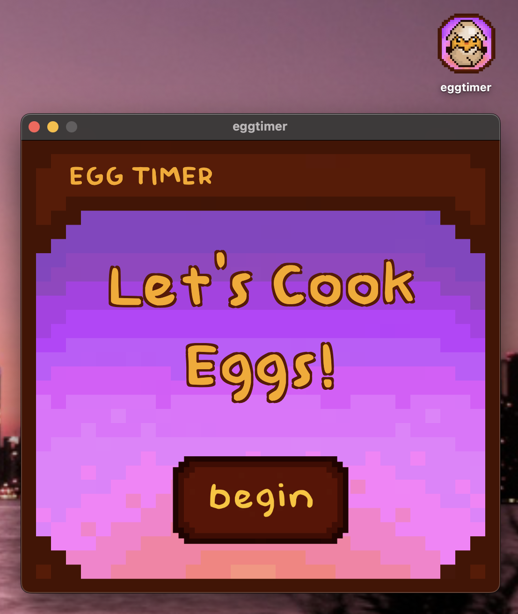
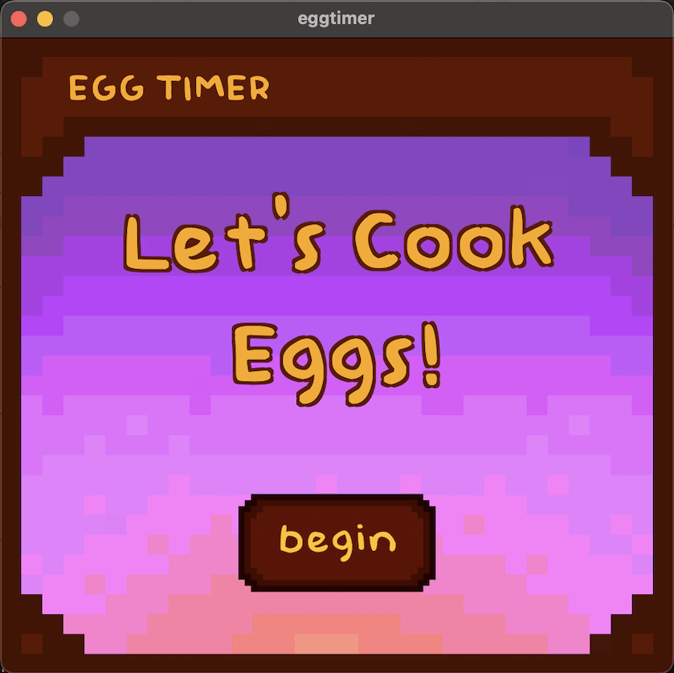

# 🐣 eggtimer

Simple cozy app that I developed out of boredom, as my first personal project. It's a cute little desktop app that times four different types of eggs for you to choose from when cooking!

I thought of creating this after a friend of mine wished they could just time any type of egg with just one click, without sehaving to search the internet. It was also inspired by nashalley on YouTube and Instagram.



---

## 🎀 Features

- ✅ Interactive UI/UX built with JavaScript, HTML, & CSS
- ✅ Developed using Electron Forge

---

## ⚙️ Tech Stack

| Frontend | Tools |
|----------|-------|
| Electron.js | Electron Forge |
| HTML | Figma |
| JavaScript | Visual Studio Code |
| CSS | Git |
| Bootstrap | GitHub |

---

## 🖼️ Demo Screenshots & UI Flow



#### 🔗 Check out the app's UI flow [here](https://github.com/dixeee/eggtimer-app/blob/main/eggtimer-ui.jpg).

---

## 💿 Installation

Clone the repository and run:

```bash
# Clone repo and open project directory on terminal
git clone https://github.com/dixeee/eggtimer-app.git
cd eggtimer-app

# Install dependencies and start the app
npm install
npm start

# Optional: Try app as packaged and distributable
npm run make
```

---

## 🪪 License

This project is licensed under the MIT License.

---

## 🧝‍♀️ Author

**Dixee Lyn Alvarez**, @dixeee on GitHub

LinkedIn: linkedin.com/in/dixee

Email: dixeelyn@outlook.com
